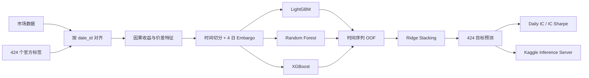

# MITSUI&CO. Commodity Prediction Challenge

[](https://www.kaggle.com/competitions/mitsui-commodity-prediction-challenge)
[](https://colab.research.google.com/github/mingzhuoFUN/mitsui-commodity-prediction/blob/main/notebooks/mitsui_competition_colab.ipynb)
[](https://www.python.org/)

面向多资产、多期限收益预测的时间序列建模系统。项目覆盖因果特征、无泄漏验证、三模型集成、424 目标推理以及 Kaggle inference server 全流程。


## 项目概览

| 项目 | 内容 |
|---|---|
| 任务 | 预测股票、外汇、LME 与 JPX 市场的收益及收益差 |
| 预测规模 | 424 个多期限目标 |
| 核心指标 | Daily IC / IC Sharpe |
| 基础模型 | Ridge、LightGBM、Random Forest、XGBoost |
| 集成方式 | 时间序列 OOF 预测 + Ridge stacking |
| 推荐入口 | [在 Google Colab 中运行完整流程](https://colab.research.google.com/github/mingzhuoFUN/mitsui-commodity-prediction/blob/main/notebooks/mitsui_competition_colab.ipynb) |

## 建模流程



## 特征体系

| 特征组 | 内容 |
|---|---|
| 价格状态 | 当前对数价格 |
| 动量 | 1、2、3、5、10、20 日对数收益 |
| 滚动统计 | 5、20、60 日收益均值与波动率 |
| Pair 特征 | 两资产对数价差、价差变化、滚动 z-score |
| 历史标签 | 按目标 horizon 模拟延迟可用的标签 |

所有 `feature[t]` 仅依赖时间不晚于 `t` 的信息，不使用未来差分、负数 shift 或 backward fill。

## 验证设计

- 使用官方 `train_labels.csv`；
- 验证集为时间轴末尾 252 天，训练与验证之间使用 4 天 embargo；
- 基础模型通过时间序列 OOF 预测训练 stacking 元模型；
- 使用 Daily IC 与 IC Sharpe 评估横截面排序能力；
- 基础模型随机种子固定为 42；
- 本地验证与 Kaggle Leaderboard 分开记录，不在不同环境间直接比较分数；
- 每次正式实验应同时记录数据版本、Python、依赖、硬件和执行日志。

完整 local gateway 已连续运行 134 个测试日，并检查：

- 连续市场历史缓存；
- `label_date_id` 历史标签更新；
- 每批 424 列预测及列顺序；
- competition inference server 调用链路。

## Google Colab

[](https://colab.research.google.com/github/mingzhuoFUN/mitsui-commodity-prediction/blob/main/notebooks/mitsui_competition_colab.ipynb)

Notebook 包含项目安装、Kaggle 数据下载、自动化测试、冒烟训练、完整验证、全量训练和 inference server 初始化。

运行前：

1. 在 Kaggle 页面接受竞赛规则。
2. 在 Colab Secrets 中添加 `KAGGLE_API_TOKEN`。
3. 选择 GPU 或高内存运行时。
4. 按顺序执行全部单元格。

训练完成后，notebook 会将模型、指标和验证预测复制到
`MyDrive/mitsui-artifacts/`，并确认文件存在且非空。

常见问题：

- Kaggle 返回 401/403：确认已经加入比赛，并给 notebook 开启 Secret 访问；
- `No module named xgboost`：重新执行依赖安装单元；
- 内存或时间不足：先完成 8-target smoke，再运行完整 424-target 训练；
- runtime 中断：从 Google Drive 恢复已经保存的模型和指标。

## 本地运行

```powershell
python -m venv .venv
.\.venv\Scripts\Activate.ps1
python -m pip install -r requirements.txt
$env:PYTHONPATH="src"
pytest
```

训练基线与集成模型：

```powershell
python scripts/train_baseline.py
python scripts/train_ensemble.py
```

运行本地推理网关：

```powershell
python scripts/run_local_gateway.py
```

## 项目结构

```text
notebooks/
  mitsui_competition_colab.ipynb  # 云端完整入口
  mitsui_model_experiments_colab.ipynb # 模型实验入口
scripts/
  train_baseline.py               # Ridge 基线
  train_ensemble.py               # 三模型 OOF stacking
  run_local_gateway.py            # 连续历史在线推理
  build_model_experiments_notebook.py # 生成模型实验 notebook
src/mitsui/
  features.py                     # 因果特征
  ensemble.py                     # 基础模型、OOF 与 stacking
  inference.py                    # 推理状态管理
  metric.py                       # Daily IC 与 IC Sharpe
  validation.py                   # 时间切分与 embargo
tests/                            # 指标、泄漏与推理测试
```

## 工程亮点

- 训练、验证和在线推理共享同一套因果特征逻辑。
- Embargo 与时间序列 OOF 共同控制泄漏风险。
- 推理模块维护连续历史状态，适配逐批次 competition gateway。
- 单元测试覆盖标签方向、列顺序、状态更新和指标计算。
