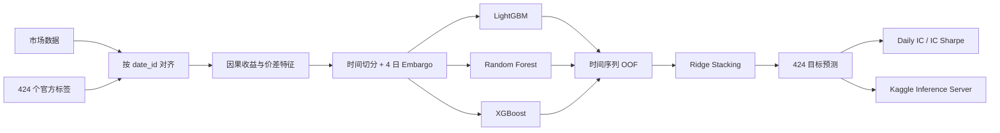

# MITSUI&CO. Commodity Prediction Challenge

[](https://www.kaggle.com/competitions/mitsui-commodity-prediction-challenge)
[](https://colab.research.google.com/github/mingzhuoFUN/mitsui-commodity-prediction/blob/main/notebooks/mitsui_competition_colab.ipynb)
[](https://www.python.org/)

面向多资产、多期限收益预测的时间序列建模系统。项目覆盖因果特征、无泄漏验证、三模型集成、424 目标推理以及 Kaggle inference server 全流程。


## 项目概览

| 项目 | 内容 |
|---|---|
| 任务 | 预测股票、外汇、LME 与 JPX 市场的收益及收益差 |
| 预测规模 | 424 个多期限目标 |
| 核心指标 | Daily IC / IC Sharpe |
| 基础模型 | Ridge、LightGBM、Random Forest、XGBoost |
| 集成方式 | 时间序列 OOF 预测 + Ridge stacking |
| 推荐入口 | [在 Google Colab 中运行完整流程](https://colab.research.google.com/github/mingzhuoFUN/mitsui-commodity-prediction/blob/main/notebooks/mitsui_competition_colab.ipynb) |

## 建模流程



## 特征体系

本项目不是使用同一张宽特征表预测全部目标，而是根据
`target_pairs.csv` 为每个目标单独选择相关资产并构造特征。每个目标包含：

- `target`：目标列名，例如 `target_9`；
- `lag`：收益预测周期，当前数据包含 1、2、3、4 日四种 horizon；
- `pair`：计算该目标所需的一个资产，或由 ` - ` 分隔的两个资产。

因此，424 个目标分别拥有自己的特征矩阵和模型。这样可以减少无关市场列
带来的噪声，也保留不同资产组合与不同预测周期之间的差异。

### 1. 原始数据处理

对目标涉及的资产列依次执行：

1. 使用 `pd.to_numeric(errors="coerce")` 将异常字符串转换为缺失值；
2. 只使用前向填充补充市场缺失值；
3. 非正价格转换为缺失值，避免对数计算产生无效结果；
4. 计算结束后将正负无穷统一替换为 `NaN`，交给模型或填补器处理。

不使用 backward fill，因为它会将未来价格填充到过去；也不使用负数
`shift` 或未来差分。

### 2. 单资产价格与动量特征

对于 pair 中的每个资产价格序列 \(P_t\)，首先计算对数价格：

\[
L_t = \log(P_t)
\]

然后构造以下特征：

| 特征 | 计算方式 | 作用 |
|---|---|---|
| 对数价格水平 | \(L_t\) | 表示资产当前所处的价格状态 |
| 1 日收益 | \(L_t-L_{t-1}\) | 捕捉最新方向变化 |
| 多周期收益 | \(L_t-L_{t-k}\)，\(k\in\{1,2,3,5,10,20\}\) | 描述短期与中期动量 |
| 滚动收益均值 | 1 日收益的 5、20、60 日均值 | 描述局部趋势 |
| 滚动波动率 | 1 日收益的 5、20、60 日标准差 | 描述市场风险和状态变化 |

滚动窗口允许一定的最小有效样本数，使序列前段能够尽早产生特征，同时
仍然只使用当前时刻及以前的数据。

### 3. 双资产关系特征

当一个目标由两个资产 \(A\) 与 \(B\) 构成时，除了分别计算上述单资产
特征，还会构造二者的相对关系：

\[
S_t = \log(P^A_t)-\log(P^B_t)
\]

| 特征 | 含义 |
|---|---|
| `pair__log_spread` | 两资产当前对数价差 |
| `pair__spread_change_1` | 对数价差的 1 日变化 |
| `pair__spread_zscore_5` | 价差相对最近 5 日分布的位置 |
| `pair__spread_zscore_20` | 价差相对最近 20 日分布的位置 |
| `pair__spread_zscore_60` | 价差相对最近 60 日分布的位置 |

价差特征用于描述两个市场之间的相对强弱、偏离程度和可能的均值回归状态，
通常比只观察两个独立价格序列更接近收益差目标本身。

### 4. 延迟可用的历史标签

在线推理时，历史标签不会立即公开。对于预测周期为 \(h\) 的目标，代码
首先设置：

\[
\text{reveal\_delay}=h+1
\]

再构造延迟量为 `reveal_delay + {0, 1, 2, 5}` 的四个历史标签特征。
这使训练阶段模拟与竞赛顺序推理一致的信息可用性，避免模型在训练时看到
线上预测时尚未公开的标签。

### 5. 每个目标的特征规模

当前配置下：

| 目标类型 | 市场特征 | 延迟标签特征 | 合计 |
|---|---:|---:|---:|
| 单资产目标 | 14 | 4 | 18 |
| 双资产目标 | 33 | 4 | 37 |

具体数量来自 1 个价格水平、收益与滚动统计，以及双资产目标额外增加的
5 个价差特征。模型会保存训练时的完整特征列顺序，推理阶段再按该顺序
重新索引，防止列错位。

### 6. 具体示例

例如某个目标定义为：

```text
target_9 | lag=1 | FX_AUDJPY - LME_PB_Close
```

模型会分别为 `FX_AUDJPY` 和 `LME_PB_Close` 构造价格、动量、趋势和
波动率特征，再增加二者的对数价差、价差变化、滚动 z-score，以及按
1 日 horizon 延迟公开的历史 `target_9`。最终只使用这些与目标直接相关的
信息训练该目标的 LightGBM、Random Forest 和 XGBoost。

### 7. 因果性约束

所有 `feature[t]` 只能依赖时间不晚于 `t` 的信息：

- 缺失值只前向填充；
- 收益和差分只回看历史；
- 滚动统计窗口以当前行结束；
- 标签按 horizon 延迟后才可用；
- 训练与验证之间设置 embargo；
- 测试会修改未来市场行，并确认过去已经生成的特征保持不变。

特征实现位于 [`src/mitsui/features.py`](src/mitsui/features.py)，对应的
未来数据泄漏测试位于 [`tests/test_features.py`](tests/test_features.py)。

## 验证设计

- 使用官方 `train_labels.csv`；
- 验证集为时间轴末尾 252 天，训练与验证之间使用 4 天 embargo；
- 基础模型通过时间序列 OOF 预测训练 stacking 元模型；
- 使用 Daily IC 与 IC Sharpe 评估横截面排序能力；
- 基础模型随机种子固定为 42；
- 本地验证与 Kaggle Leaderboard 分开记录，不在不同环境间直接比较分数；
- 每次正式实验应同时记录数据版本、Python、依赖、硬件和执行日志。

完整 local gateway 已连续运行 134 个测试日，并检查：

- 连续市场历史缓存；
- `label_date_id` 历史标签更新；
- 每批 424 列预测及列顺序；
- competition inference server 调用链路。

## Google Colab

[](https://colab.research.google.com/github/mingzhuoFUN/mitsui-commodity-prediction/blob/main/notebooks/mitsui_competition_colab.ipynb)

Notebook 包含项目安装、Kaggle 数据下载、自动化测试、冒烟训练、完整验证、全量训练和 inference server 初始化。

运行前：

1. 在 Kaggle 页面接受竞赛规则。
2. 在 Colab Secrets 中添加 `KAGGLE_API_TOKEN`。
3. 选择 GPU 或高内存运行时。
4. 按顺序执行全部单元格。

训练完成后，notebook 会将模型、指标和验证预测复制到
`MyDrive/mitsui-artifacts/`，并确认文件存在且非空。

常见问题：

- Kaggle 返回 401/403：确认已经加入比赛，并给 notebook 开启 Secret 访问；
- `No module named xgboost`：重新执行依赖安装单元；
- 内存或时间不足：先完成 8-target smoke，再运行完整 424-target 训练；
- runtime 中断：从 Google Drive 恢复已经保存的模型和指标。

## 本地完整方法 Notebook

[`notebooks/mitsui_complete_workflow.ipynb`](notebooks/mitsui_complete_workflow.ipynb)
是一份不依赖 Colab 的单文件完整方法说明，可在本地 Jupyter、JupyterLab
或 VS Code Notebook 中运行。它直接包含数据读取、特征工程、时间验证、
三模型 OOF stacking、指标、模型保存和顺序推理代码，适合从头理解整个项目。

默认仅训练 8 个目标进行快速检查；将 notebook 中的
`RUN_FULL_TRAINING=True` 后可切换为完整 424 目标流程。

## 本地运行

```powershell
python -m venv .venv
.\.venv\Scripts\Activate.ps1
python -m pip install -r requirements.txt
$env:PYTHONPATH="src"
pytest
```

训练基线与集成模型：

```powershell
python scripts/train_baseline.py
python scripts/train_ensemble.py
```

运行本地推理网关：

```powershell
python scripts/run_local_gateway.py
```

## 项目结构

```text
notebooks/
  mitsui_competition_colab.ipynb  # 云端完整入口
  mitsui_complete_workflow.ipynb  # 本地单文件完整方法
  mitsui_model_experiments_colab.ipynb # 模型实验入口
scripts/
  train_baseline.py               # Ridge 基线
  train_ensemble.py               # 三模型 OOF stacking
  run_local_gateway.py            # 连续历史在线推理
  build_complete_workflow_notebook.py # 生成本地完整方法 notebook
  build_model_experiments_notebook.py # 生成模型实验 notebook
src/mitsui/
  features.py                     # 因果特征
  ensemble.py                     # 基础模型、OOF 与 stacking
  inference.py                    # 推理状态管理
  metric.py                       # Daily IC 与 IC Sharpe
  validation.py                   # 时间切分与 embargo
tests/                            # 指标、泄漏与推理测试
```

## 工程亮点

- 训练、验证和在线推理共享同一套因果特征逻辑。
- Embargo 与时间序列 OOF 共同控制泄漏风险。
- 推理模块维护连续历史状态，适配逐批次 competition gateway。
- 单元测试覆盖标签方向、列顺序、状态更新和指标计算。
