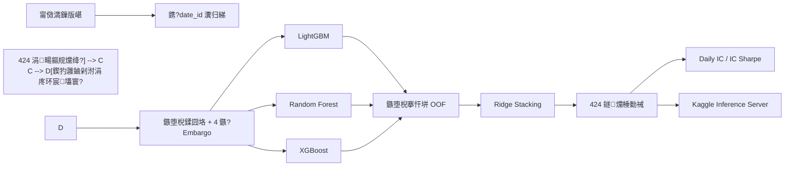

# MITSUI&CO. Commodity Prediction Challenge

[](https://www.kaggle.com/competitions/mitsui-commodity-prediction-challenge)
[](https://colab.research.google.com/github/mingzhuoFUN/mitsui-commodity-prediction/blob/main/notebooks/mitsui_competition_colab.ipynb)
[](https://www.python.org/)

闈㈠悜澶氳祫浜с€佸鏈熼檺鏀剁泭棰勬祴鐨勬椂闂村簭鍒楀缓妯＄郴缁熴€傞」鐩鐩栧洜鏋滅壒寰併€佹棤娉勬紡楠岃瘉銆佷笁妯″瀷闆嗘垚銆?24 鐩爣鎺ㄧ悊浠ュ強 Kaggle inference server 鍏ㄦ祦绋嬨€?
## 椤圭洰姒傝

| 椤圭洰 | 鍐呭 |
|---|---|
| 浠诲姟 | 棰勬祴鑲＄エ銆佸姹囥€丩ME 涓?JPX 甯傚満鐨勬敹鐩婂強鏀剁泭宸?|
| 棰勬祴瑙勬ā | 424 涓鏈熼檺鐩爣 |
| 鏍稿績鎸囨爣 | Daily IC / IC Sharpe |
| 鍩虹妯″瀷 | Ridge銆丩ightGBM銆丷andom Forest銆乆GBoost |
| 闆嗘垚鏂瑰紡 | 鏃堕棿搴忓垪 OOF 棰勬祴 + Ridge stacking |
| 鎺ㄨ崘鍏ュ彛 | [鍦?Google Colab 涓繍琛屽畬鏁存祦绋媇(https://colab.research.google.com/github/mingzhuoFUN/mitsui-commodity-prediction/blob/main/notebooks/mitsui_competition_colab.ipynb) |

## 寤烘ā娴佺▼



## 鐗瑰緛浣撶郴

| 鐗瑰緛缁?| 鍐呭 |
|---|---|
| 浠锋牸鐘舵€?| 褰撳墠瀵规暟浠锋牸 |
| 鍔ㄩ噺 | 1銆?銆?銆?銆?0銆?0 鏃ュ鏁版敹鐩?|
| 婊氬姩缁熻 | 5銆?0銆?0 鏃ユ敹鐩婂潎鍊间笌娉㈠姩鐜?|
| Pair 鐗瑰緛 | 涓よ祫浜у鏁颁环宸€佷环宸彉鍖栥€佹粴鍔?z-score |
| 鍘嗗彶鏍囩 | 鎸夌洰鏍?horizon 妯℃嫙寤惰繜鍙敤鐨勬爣绛?|

鎵€鏈?`feature[t]` 浠呬緷璧栨椂闂翠笉鏅氫簬 `t` 鐨勪俊鎭紝涓嶄娇鐢ㄦ湭鏉ュ樊鍒嗐€佽礋鏁?shift 鎴?backward fill銆?
## 楠岃瘉缁撴灉

| 妯″瀷 | 鐩爣鏁?| 楠岃瘉澶╂暟 | IC Sharpe | Mean Daily IC |
|---|---:|---:|---:|---:|
| Ridge baseline | 424 | 252 | 0.1466 | 0.0242 |
| LGBM + RF + XGB OOF stacking | 424 | 252 | **0.2005** | **0.0434** |

> 琛ㄤ腑缁撴灉鏉ヨ嚜鏈湴鏃堕棿鐣欏嚭楠岃瘉锛屼笉浠ｈ〃 Kaggle Leaderboard 鍒嗘暟銆?
瀹屾暣 local gateway 宸茶繛缁繍琛?134 涓祴璇曟棩锛屽苟妫€鏌ワ細

- 杩炵画甯傚満鍘嗗彶缂撳瓨锛?- `label_date_id` 鍘嗗彶鏍囩鏇存柊锛?- 姣忔壒 424 鍒楅娴嬪強鍒楅『搴忥紱
- competition inference server 璋冪敤閾捐矾銆?
## Google Colab

[](https://colab.research.google.com/github/mingzhuoFUN/mitsui-commodity-prediction/blob/main/notebooks/mitsui_competition_colab.ipynb)

Notebook 鍖呭惈椤圭洰瀹夎銆並aggle 鏁版嵁涓嬭浇銆佽嚜鍔ㄥ寲娴嬭瘯銆佸啋鐑熻缁冦€佸畬鏁撮獙璇併€佸叏閲忚缁冨拰 inference server 鍒濆鍖栥€?
杩愯鍓嶏細

1. 鍦?Kaggle 椤甸潰鎺ュ彈绔炶禌瑙勫垯銆?2. 鍦?Colab Secrets 涓坊鍔?`KAGGLE_API_TOKEN`銆?3. 閫夋嫨 GPU 鎴栭珮鍐呭瓨杩愯鏃躲€?4. 鎸夐『搴忔墽琛屽叏閮ㄥ崟鍏冩牸銆?
## 鏈湴杩愯

```powershell
python -m venv .venv
.\.venv\Scripts\Activate.ps1
python -m pip install -r requirements.txt
$env:PYTHONPATH="src"
pytest
```

璁粌鍩虹嚎涓庨泦鎴愭ā鍨嬶細

```powershell
python scripts/train_baseline.py
python scripts/train_ensemble.py
```

杩愯鏈湴鎺ㄧ悊缃戝叧锛?
```powershell
python scripts/run_local_gateway.py
```

## 椤圭洰缁撴瀯

```text
notebooks/
  mitsui_competition_colab.ipynb  # 浜戠瀹屾暣鍏ュ彛
scripts/
  train_baseline.py               # Ridge 鍩虹嚎
  train_ensemble.py               # 涓夋ā鍨?OOF stacking
  run_local_gateway.py            # 杩炵画鍘嗗彶鍦ㄧ嚎鎺ㄧ悊
src/mitsui/
  features.py                     # 鍥犳灉鐗瑰緛
  ensemble.py                     # 鍩虹妯″瀷銆丱OF 涓?stacking
  inference.py                    # 鎺ㄧ悊鐘舵€佺鐞?  metric.py                       # Daily IC 涓?IC Sharpe
  validation.py                   # 鏃堕棿鍒囧垎涓?embargo
tests/                            # 鎸囨爣銆佹硠婕忎笌鎺ㄧ悊娴嬭瘯
```

## 宸ョ▼浜偣

- 璁粌銆侀獙璇佸拰鍦ㄧ嚎鎺ㄧ悊鍏变韩鍚屼竴濂楀洜鏋滅壒寰侀€昏緫銆?- Embargo 涓庢椂闂村簭鍒?OOF 鍏卞悓鎺у埗娉勬紡椋庨櫓銆?- 鎺ㄧ悊妯″潡缁存姢杩炵画鍘嗗彶鐘舵€侊紝閫傞厤閫愭壒娆?competition gateway銆?- 鍗曞厓娴嬭瘯瑕嗙洊鏍囩鏂瑰悜銆佸垪椤哄簭銆佺姸鎬佹洿鏂板拰鎸囨爣璁＄畻銆?
